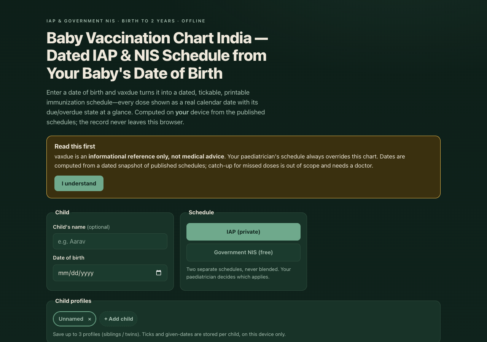

# vaxdue

**Baby vaccination chart for India, dated from your baby's date of birth.** Enter a date
of birth and vaxdue turns it into a dated, tickable, printable immunization schedule —
every dose shown as a real calendar date with its due / overdue state at a glance,
computed from the published **IAP** and **Government NIS** schedules. The record never
leaves your device.

## Why

Every wall chart tells you a dose is due "at 6 weeks" or "at 9 months" and leaves the
date arithmetic to a tired new parent. vaxdue does the arithmetic: give it one date of
birth and it prints the whole schedule as actual dates, flags what is due or overdue
today, lets you tick doses as they are given, and produces a clean sheet to carry to the
clinic — all without an account and without a single network call.

## Features

- **Dated from the date of birth** — every dose becomes a real calendar date via honest
  calendar arithmetic (week offsets, month-end clamping, leap years).
- **IAP and NIS, never blended** — switch between the Indian Academy of Pediatrics
  schedule (private-practice standard) and the Government of India NIS (free at public
  facilities). Each row shows its own source citation.
- **Status at a glance** — every dose is *upcoming*, *due*, *overdue*, or *done*, shown
  with a glyph and a word (never colour alone). Overdue and due-now doses surface in a
  summary strip at the top.
- **Tick doses given** — mark a dose done with an optional given-on date; saved per child.
- **Up to 3 child profiles** — for siblings and twins; each child's ticks are stored
  separately, on this device only.
- **Printable clinic sheet** — a clean A4 print layout with the child's name, date of
  birth, edition, verified-on date and disclaimer in the footer.
- **CSV export** — the full schedule with due dates and given/pending status (RFC-4180).
- **100% offline** — no accounts, no network, no tracking. The child's health record
  never leaves your browser.

## Quickstart

Just open `index.html` in any modern browser — no build step, no server, no install.

- **Local:** double-click `index.html`, or run a static server in the folder.
- **Hosted:** **[Open vaxdue live](https://sreenivas-sadhu-prabhakara.github.io/vaxdue/)**

Your child profiles and ticked doses are saved in your browser's local storage and
persist between visits.

## Privacy

vaxdue is built so a child's health record provably stays on the device.

- A strict Content-Security-Policy sets `connect-src 'none'`: the app **cannot** make any
  network request even if it tried. The browser itself blocks any send.
- No external fonts, scripts, images, or analytics. Everything is self-contained.
- All logic runs in your browser. Nothing about your child is ever transmitted or stored
  anywhere but your own device.
- Because there are no network dependencies, it works fully offline.

## Data sources & honesty

vaxdue ships **two schedules with different provenance** (full detail in
[`sources/CITATIONS.md`](./sources/CITATIONS.md)):

- **NIS (primary):** transcribed **verbatim** from the official MoHFW / NHM
  *National Immunization Schedule* PDF, including its PCV and JE footnotes.
- **IAP (secondary):** cross-verified from two agreeing secondary sources because the
  primary Indian Pediatrics 2023 full-text PDF was not machine-accessible at build time.
  The app labels IAP rows clearly and asks you to confirm with your paediatrician.

Corpus last verified: **2026-07-22**. Scope: **birth to 24 months only** (v0.1);
2–18 years is a future version. Catch-up scheduling is deliberately out of scope.

## Disclaimer

vaxdue is an **informational reference only — not medical advice**, not a medical device,
and not a diagnosis. Your paediatrician's schedule always overrides this chart. Dates are
computed from a **dated snapshot** of published schedules (edition and verified-on date
shown in the app); immunization schedules are revised over time, so confirm current
recommendations at your clinic. Catch-up for missed or delayed doses is out of scope —
the chart flags a dose overdue but a doctor must plan the catch-up. Some doses are
conditional (for example JE in endemic districts, or state-specific PCV); vaxdue flags the
condition but cannot decide it for your child. The official immunization card issued by
your health provider remains the record of truth. This software is provided under the MIT
License, "as is", without warranty of any kind; the authors accept no liability for any
loss, injury, or damage arising from its use.

## License

[MIT](./LICENSE) © 2026 Sreenivas Sadhu Prabhakara
